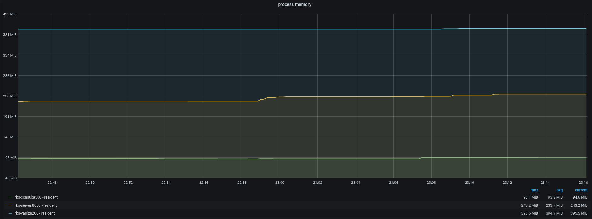
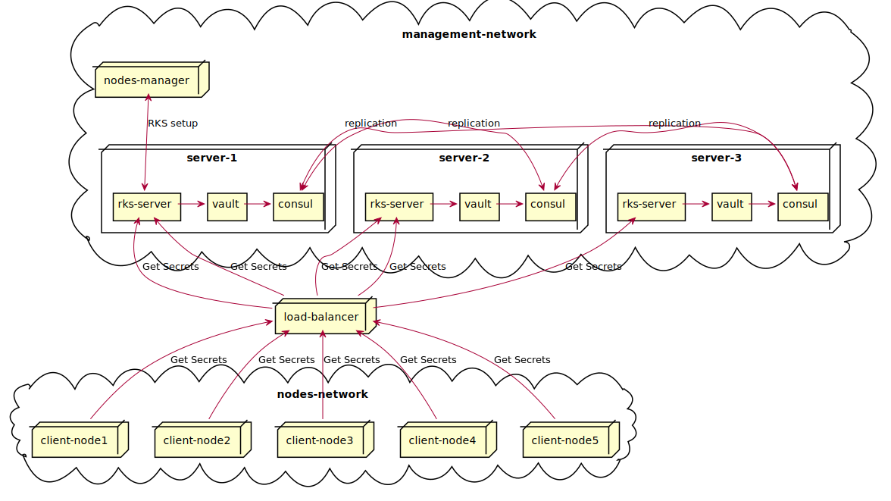
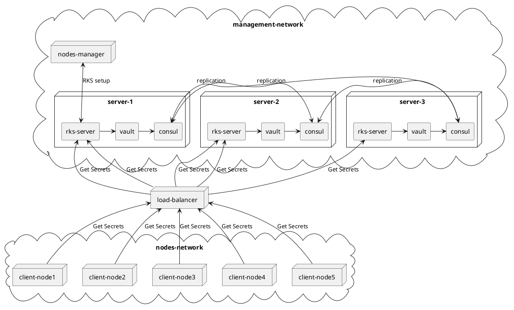

# RKS Components

- Remote Key Server - API server
- Hashicorp Vault - Open Source secret manager
- Hashicorp Consul - Open Source database for secret storage
- rks-cli - command line administration client

# Sources

Authoritative Vault and Consul deployment resources:

- [Vault Reference Architecture](https://learn.hashicorp.com/vault/operations/ops-reference-architecture)
- [Vault Deployment Guide](https://learn.hashicorp.com/vault/day-one/ops-deployment-guide)
- [Vault Production Hardening](https://learn.hashicorp.com/vault/day-one/production-hardening)
- [Consul Reference Architecture](https://learn.hashicorp.com/consul/datacenter-deploy/reference-architecture)

# Network flows

| Usage                      | Source        | Destination   | Protocol       | Port     |
| ---                        | ---           | ---           | ---            | ---      |
| Group Manager Registration | Group Manager | RKS           | HTTPS          | TCP/443  |
| Client Node Registration   | Client Node   | RKS           | HTTPS          | TCP/443  |
| Client Node Validation     | RKS           | Group Manager | HTTPS          | TCP/443? |
| Client Node Secrets access | Client Node   | RKS           | HTTPS          | TCP/443  |
| RKS Vault Access           | RKS           | Vault         | HTTPS          | TCP/8200 |
| Consul Clustering          | Consul        | Consul        | RAFT           | TCP/8300 |
| Vault Clustering           | Vault         | Vault         | Req Forwarding | TCP/8201 |

# Infrastructure

RKS can run on **bare metal** / **VM** / **containers** and has no hard dependency on a specific Operating System

Our development setup starts each RKS component in a Docker container

Our ansible deployment playbooks originally deployed RKS components inside Debian LXC containers provisionned on Proxmox lab cluster

The ansible playbook can also deploy indifferently to: Alpine / Debian / Centos / RHEL machines (Bare metal or VMs)

RKS leverages Consul database to ensure fault tolerance. This requires 3 or more machines deployed to allow for at least one machine failure (See Architecture below)

# Dimensioning

## Network requests

RKS peak load dimensioning is function of the :
- Number of secrets
- Number of client nodes (web caches, load balancers, web servers)
- Secrets ttl

`nb_rks_requests per second ~= nb_secrets * nb_client_nodes / ttl`

So for 100 secrets, 100 client nodes, a secret TTL of 1h (3600s) and all services accessed from all client nodes we can expect **10 000** requests per hour => ~ 3req/s

__Bandwidth consumption__: considering a let's encrypt secret, with its fullchain certificate and a 2048 bit RSA key it would be around 6KB per secret. 6KB times 10k requests per hour leads to 60MB egress bandwidth per hour.

## Resources

RKS storage requirement is low as we store only text objects (certificates/private keys)

When 100 secrets are loaded, making a consul database snapshots result in a 1MB file.

Loading 100 secrets into the RKS and running ~55 req/s for 30 minutes yields the following memory usage:

# Example deployment architecture diagram

Load balancing can be done via DNS or using a hardware/software load balancer.

Deployment is represented here on 3 "machines", virtual or bare metal. A deployment on a container orchestrator such as Kubernetes will differ.

Vault instances will forward client request to the currently elected Vault leader. This is not shown here to avoid cluttering the diagram.

<!--

-->
